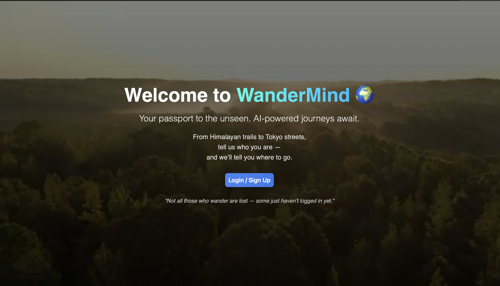
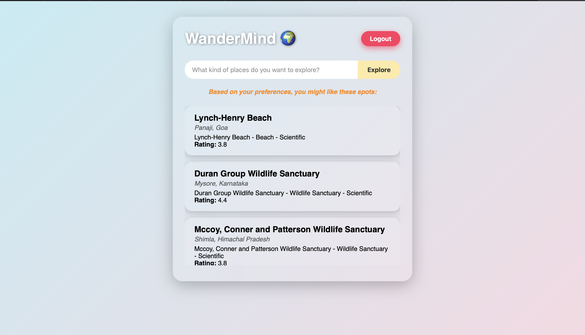
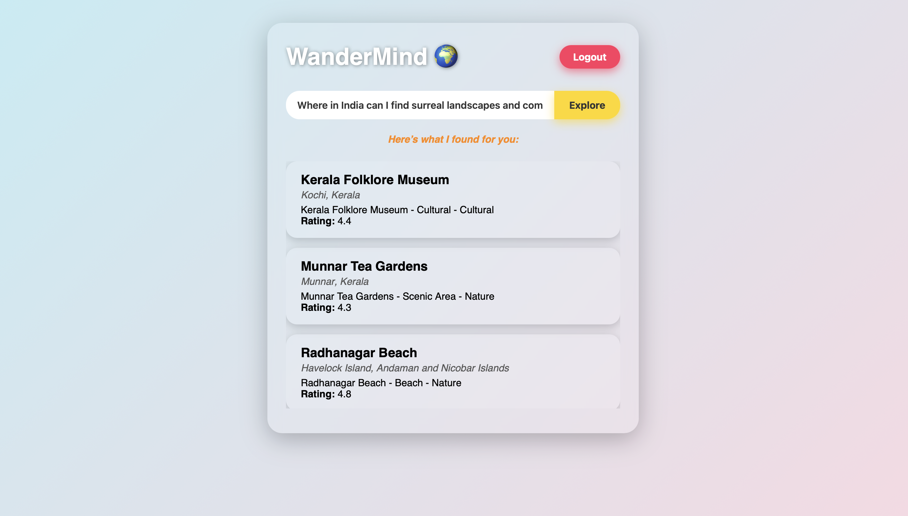

🧳 Prompt-Based Indian Travel Recommendation System

This repository contains a full-stack AI travel recommendation system inspired by natural-language-driven apps like ChatGPT. It features a React frontend, a FastAPI backend, and a MongoDB database. The backend leverages a PyTorch-based machine learning model trained on curated Indian travel data.

📚 Table of Contents

🚀 Features
🧱 Architecture
⚙️ Prerequisites
📦 Installation & Running the Application
📁 Project Structure
🔌 API Endpoints
🛠️ Troubleshooting
🖼️ Project Screenshots
🚀 Features

Prompt-Based Recommendations: Suggests Indian destinations based on natural-language prompts.
AI-Powered Inference: Uses a fine-tuned ML model trained on travel data and embeddings.
User Prompt History: Save and view all your previous search prompts.
Modern Stack: FastAPI, MongoDB, React, Docker.
Pre-Trained Model: Utilizes a custom PyTorch recommendation model.
🧱 Architecture

+-----------+         +-----------+         +------------+
|  Frontend | <-----> |  Backend  | <-----> |  MongoDB   |
|  (React)  |  REST   | (FastAPI) |  ODM    | (Docker)   |
+-----------+         +-----------+         +------------+
Frontend: React + Vite
Backend: FastAPI, PyTorch inference, MongoDB data layer
Database: MongoDB containerized via Docker
⚙️ Prerequisites

Docker
Git
Python 3.9+ (for manual run)
Node.js (for manual run)
📦 Installation & Running the Application

1. Clone the Repository
git clone https://github.com/your-username/travel-recommendation-app.git
cd travel-recommendation-app
2. Directory Structure
Recommendation_System/
├── backend/
│   ├── db/
│   ├── models/
│   ├── routes/
│   ├── services/
│   ├── Top Indian Places to Visit.csv
│   ├── trained_recommendation_model.pth
│   ├── requirements.txt
│   ├── Dockerfile
│   ├── .env
│   └── main.py
├── frontend/
│   ├── public/
│   ├── src/
│   │   └── pages/
│   ├── Dockerfile
│   └── package.json
├── docker-compose.yml
└── README.md
3. Run with Docker 🐳
docker-compose up --build
This will:

Build backend and frontend Docker images
Start the MongoDB container
Serve:
Backend at: http://localhost:8000
Frontend at: http://localhost:5173
4. Stop the Application
docker-compose down
📁 Project Structure

backend/: FastAPI app, ML model, MongoDB logic
frontend/: React app (Vite-based, with pages instead of components)
docker-compose.yml: Orchestrates services
README.md: You’re reading it!
🔌 API Endpoints

Auth
POST /signup: Register a new user
POST /login: Authenticate and get token
Recommendations
POST /recommend: Get travel places for a natural prompt
GET /recommend/inferred: AI auto-suggestions
GET /place/{sno}: Details for a place
GET /user/{user_id}/prompts: Past prompt history
🛠️ Troubleshooting

Problem	Solution
Docker Build Fails	Ensure Docker is installed and running
Port Conflicts	Make sure ports 8000 and 5173 are free
MongoDB Errors	Check the mongo container logs
Changes Not Reflecting	Run docker-compose up --build again
Backend Not Found	Verify .env and model file paths are valid
🖼️ Project Screenshots

