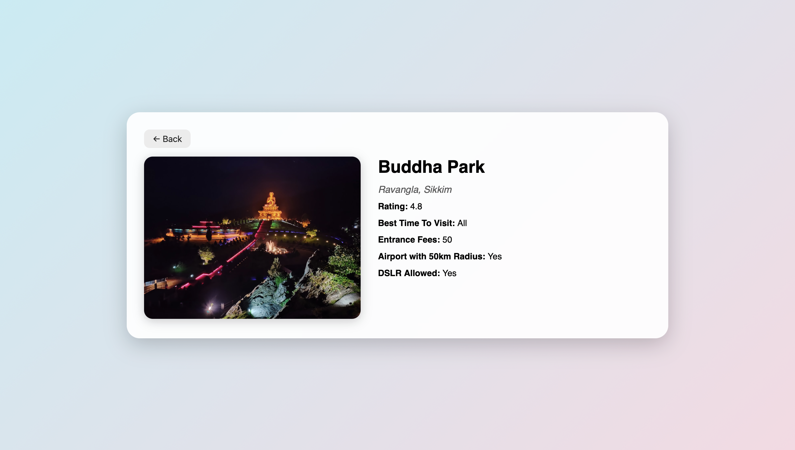

# 🧳 Prompt-Based Indian Travel Recommendation System

This repository contains a full-stack AI travel recommendation system inspired by natural-language-driven apps like ChatGPT. It features a React frontend, a FastAPI backend, and a MongoDB database. The backend leverages a PyTorch-based machine learning model trained on curated Indian travel data.

## 📚 Table of Contents

- 🚀 Features
- 🧱 Architecture
- ⚙️ Prerequisites
- 📦 Installation & Running the Application
- 📁 Project Structure
- 🔌 API Endpoints
- 🛠️ Troubleshooting
- 🖼️ Project Screenshots

## 🚀 Features

- Prompt-Based Recommendations: Suggests Indian destinations based on natural-language prompts.
- AI-Powered Inference: Uses a fine-tuned ML model trained on travel data and embeddings.
- User Prompt History: Save and view all your previous search prompts.
- Modern Stack: FastAPI, MongoDB, React, Docker.
- Pre-Trained Model: Utilizes a custom PyTorch recommendation model.

## 🧱 Architecture

```

+-----------+         +-----------+         +------------+
\| Frontend  | <-----> | Backend   | <-----> | MongoDB    |
\| (React)   |  REST   | (FastAPI) |  ODM    | (Docker)   |
+-----------+         +-----------+         +------------+

````

- Frontend: React + Vite  
- Backend: FastAPI, PyTorch inference, MongoDB data layer  
- Database: MongoDB containerized via Docker

## ⚙️ Prerequisites

- Docker  
- Git  
- Python 3.9+ (for manual run)  
- Node.js (for manual run)

## 📦 Installation & Running the Application

1. Clone the Repository
git clone https://github.com/shivamkalra123/Recommendation_System.git
cd Recommendation_System
## Directory Structure

- Recommendation_System/
  - backend/
    - app/
    - db/
    - models/
    - routes/
    - services/
    - .env
    - Dockerfile
    - main.py
    - requirements.txt
    - Top Indian Places to Visit.csv
    - trained_recommendation_model.pth
  - frontend/
    - Dockerfile
    - public/
    - src/
      - pages/
      - App.js
  - docker-compose.yml
  - README.md
```

### 3. Run with Docker 🐳

```bash
docker-compose up --build
```

This will:

* Build backend and frontend Docker images
* Start the MongoDB container
* Serve backend at: [http://localhost:8000](http://localhost:8000)
* Serve frontend at: [http://localhost:5173](http://localhost:5173)

### 4. Stop the Application

```bash
docker-compose down
```

## 📁 Project Structure

* backend/: FastAPI app, ML model, MongoDB logic
* frontend/: React app (Vite-based, with pages instead of components)
* docker-compose.yml: Orchestrates services
* README.md: You’re reading it!

## 🔌 API Endpoints

### Auth

* POST /signup: Register a new user
* POST /login: Authenticate and get token

### Recommendations

* POST /recommend: Get travel places for a natural prompt
* GET /recommend/inferred: AI auto-suggestions
* GET /place/{sno}: Details for a place
* GET /user/{user\_id}/prompts: Past prompt history

## 🛠️ Troubleshooting

| Problem                | Solution                                   |
| ---------------------- | ------------------------------------------ |
| Docker Build Fails     | Ensure Docker is installed and running     |
| Port Conflicts         | Make sure ports 8000 and 5173 are free     |
| MongoDB Errors         | Check the mongo container logs             |
| Changes Not Reflecting | Run docker-compose up --build again        |
| Backend Not Found      | Verify .env and model file paths are valid |

## 🖼️ Project Screenshots




